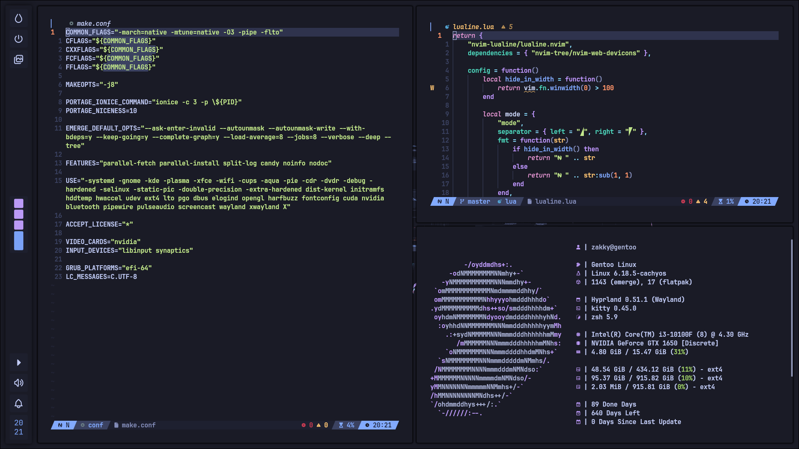

# 🛸 Gentoo Dotfiles

Welcome to my Gentoo dotfiles built for efficiency and aesthetics. 


## ✨ Features

- 🎨 **TokyoNight Theme**: A perfect blend of vibrant colors.
- 🪟 **Hyprland + Noctalia Shell**: 10/10 Compositor for Wayland and QuickShell config.
- 🧇 **Tmux**: With my own options.
- 🌟 **Zsh + PowerLevel10k**: Efficient shell setup with lots of aliases.

## 🚀 Installation

To get started with this setup, follow these steps:

1. **Clone the Repository**:

	```bash
    git clone https://github.com/zakky20/dotfiles
    cd nixos-config-reborn
    ```

2. **Go into the cloned directory and move everything to ~/.config**

    ```bash
    cd dotfiles
    sudo mv * ~/.config
    ```

## 😎 Enjoy!



## 🤝 Contributions

Feel free to fork the repository and submit pull requests if you'd like to contribute improvements. Open issues if you encounter any problems with the config or have ideas for new features.
